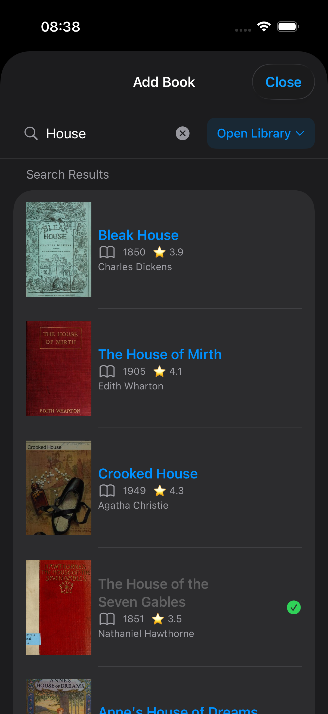
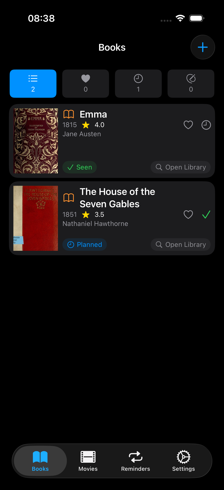
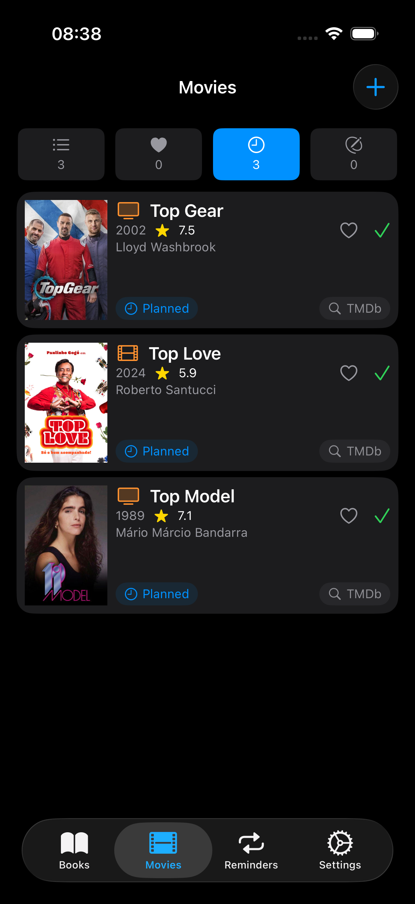
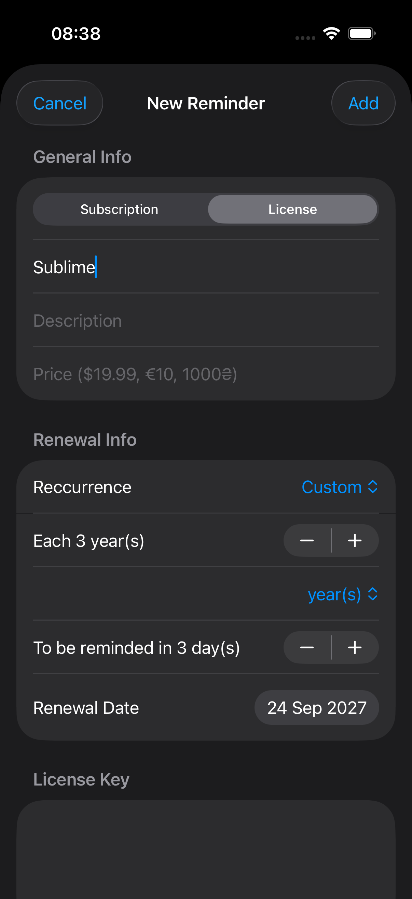
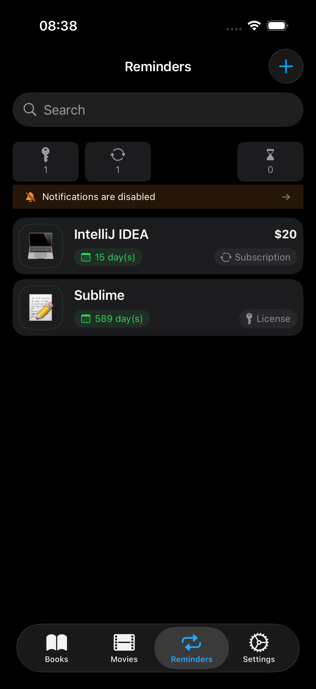

# I Wanna RWX

iOS application for Films-Books-Reminders notes

## Motivation & Purpose
### The Problem

We've all been there: chatting with a friend or browsing online when someone mentions an amazing book or movie. You want to save it for later, but where?

- Standard notes apps become cluttered - Creating separate notes for each recommendation quickly turns into digital chaos
- Lists get lost - When you finally want to watch that movie or read that book, finding your list among hundreds of notes is frustrating
- No quick access - You need something always at hand, not buried in folders

Additionally, we all have recurring items that need tracking - subscriptions, licenses, memberships - but they're not important enough for a dedicated budgeting app, yet too important to forget.

### The Solution
A minimalist app that keeps two essential lists always accessible:
- "To `R`ead" and "To `W`atch" lists - Quick capture with instant search to official sources
- Recurring reminders - Track subscriptions and e`X`pirable items without the overhead

Simple. Focused. Always ready when you need it.

## 📚/🎬 Module 1: Books & Movies

**Core Features**:
- Quick Add - Save recommendations in seconds while they're fresh in your mind
- Smart Search
  - Powered by OpenLibrary's free API to find official book data
  - Powered by TMDb free API to find official movie data. Though you'd obligate to obtain the API key by your own and put in App's settings
- Filtering - Toggle between "All", "Favorites", and "Planned"
- Direct Links - Tap the cover to open OpenLibrary / TMDb page for details
- Full Descriptions - Long-press item card to read the complete summary

**Why it works**: No complicated categorization. No overwhelming features. Just a clean list that's always one tap away.

## 🔔 Module 2: Recurring Items (Subscriptions & Licenses)

**Core Features**:
- Track Renewals - Monthly, yearly, lifetime, or custom periods
- Expiration Alerts - Get notified before items expire
- License Storage - Securely store license keys with multi-line support
- Smart Filtering - View expiring soon, expired, or all items
- Notes - Add context for each subscription or license

**Use Cases**:
- Netflix, Spotify subscriptions
- Adobe, JetBrains licenses
- Domain renewals
- Gym memberships
- Any recurring payment or expirable item

Purpose: Remember renewal dates and keep license keys organized - without overthinking it.

## App Philosophy
- Minimal but useful - Just enough features to solve real problems, nothing more.
- Always accessible - Two taps from home screen to the exact list you need.
- No complexity - No categories, tags, or over-organization. Just clean, functional lists.
- No Ad
- KISS - Keep it simple and specific. Only things to remind you. No personalized movie recommendations,
no media content download, no book reader, etc

## Target Users

- Book lovers who get recommendations from friends but forget titles
- Movie enthusiasts building their watch list
- Subscription users tired of surprise renewal charges
- Software users who need to track license renewals
- Anyone who values simplicity over feature bloat

## Other

Doubtable decisions made 🤔:
- runtime language switch is not supported: only device locale to be used
- no import/export/share
- no soft delete

Open Questions:
- Does this app really need to be iPad compatible?
- Other datasources to be added

Feedbacks:
- Any issues / comments / questions can be left as an 'Issue' within this repostiory

Data Sources being considered:
  - Video:
    - [TMDb](https://www.themoviedb.org/) . Used existing [TMDb Swing package](https://github.com/adamayoung/TMDb) to operate with. Requires registration and API token obtaining and providing to the application.
  - Books:
    - [OpenLibrary](https://openlibrary.org/) , self-written client
  - Other (not included) data sources considered:
    - [GoodreadsService](https://www.goodreads.com/) - another Book search service. They don't provide API anymore. At this stage no desire to write/use act-like-a-human client. Possibly to be implemented in future
    - [OMDb](https://www.omdbapi.com/). Do we need it having TMDb ?
    - [IMDb](https://www.imdb.com/). They don't have API, and do we need it having TMDb ?
    - HdRezka

## Screenshots

Books: 

  
  

Movies:

  

Reminders:

  
  

